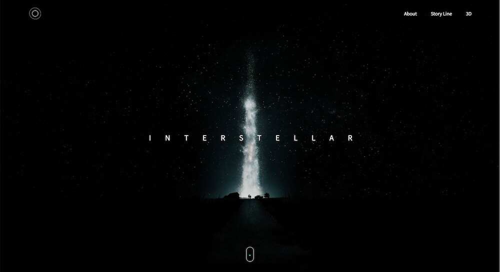

# Interstellar
영화 '인터스텔라' 웹사이트 입니다.
2020년 학교과제로 만든 사이트를 다시 디자인 후 제작하였습니다.

## 사용 언어
 - HTML, CSS, JavaScript 
### 중점 작업  
1. 미디어 쿼리와 display: flex; 를 사용하여 반응형 웹페이지를 제작하는데 집중하였습니다.  
2. 기초적인 vanilla javascript를 연습하기 위하여 jQuery를 사용하지 않았습니다.  
3. 2D 그래픽과 3D 그래픽이 자연스럽게 이어지도록 만들었습니다.
4. 기존에 자주 사용하던 오퍼시티 페이드인 대신 다른 효과들을 제작해보았습니다.

## 웹사이트 구성

### Header 
좌측에는 HTML과 CSS로 움직이는 로고를 만들었습니다.   
두 개의 사각형을 만들고 border-radius로 원 형태를 만들었습니다.   
display: flex; 를 이용하여 정중앙에 배치 후 밖에 있는 원을 css animation 을 이용하여 움직임을 추가하였습니다.   

CSS

    header > a > span{position: absolute; border-radius: 50%; transition: 500ms;}
    header > a > span.logo_out{width: 40px; height: 40px; animation: turn_logo 5s linear infinite; border: 1px dotted #fff; }
    header > a > span.logo_in{width: 20px; height: 20px; border: 1px solid #fff; }
    header > a:hover > span.logo_in{background: #fff;}
    @keyframes turn_logo{
        0%{transform: rotate3d(0.5, 0.5, 0.5, 360deg);}
        100%{transform: rotate3d(0deg);}
    }

우측에는 내비게이션을 만들어 클릭 시 해당 위치로 이동하게 만들었습니다.   
jQuery를 사용하여 이동하는 것이 아닌 href="" 에 id 값을 넣어 이동하게 만들었고,   
scroll-behavior: smooth; 를 사용하여 부드럽게 이동되도록 하였습니다.   

HTML

    <ul>
        <li><a href="#about">About</a></li>
        <li><a href="#story_line">Story Line</a></li>
        <li><a href="#3D">3D</a></li>
    </ul>

CSS

    html{scroll-behavior: smooth;}

### Main
페이지 로드 시 보이는 부분입니다.    
배경에 이미지를 넣고 중앙에는 텍스트를 넣었습니다.   

### Count
스크롤 시 카운트가 증가하며 영화의 정보를 숫자로 보여주는 부분입니다.   
JavaScript의 setInterval을 사용하여 1씩 빠르게 증가하도록 만들었으며     
원하는 숫자에 도달하면 clearInterval으로 멈추게 만들었습니다.   
스크롤을 하면 함수가 실행되게 만들었더니 계속 나오는 현상이 있어   
함수 호출 후에는 is_Count 변수를 참으로 만들어 한 번만 실행되도록 만들었습니다.   

JavaScript

    if(is_Count){
        return 
    }
    let i = start;
    let timer = setInterval(()=>{
        i++;
        target.innerHTML = i;
        if(i == end){
            for(let i = 0 ; i < count_txt.length ; i++){
                count_txt[i].classList.add("active_count_txt");
            }
            clearInterval(timer);
        }
    }, speed)

### Story   
우주비행사 이미지를 배치 후 마우스의 위치값에 따라    
left와 top 값을 변경시켜 동적인 움직임을 만들었습니다.   

### About
배경이 이미지에서 컬러로 넘어가는 부분을 자연스럽게 이어주기 위하여   
이미지를 중간에 배치 후 그림자를 추가하였습니다.

### Story Line
리스트에 마우스 호버 시 이미지들이 뜨도록 하였습니다.    
이미지의 위치값과 너비를 %로 만들어 화면이 줄어들더라도    
어색해 보이지 않도록 만들었습니다.    

### Steel Cut
가장 신경 쓰며 만들었던 부분입니다.    
스크롤 시 줌아웃되며 여러 이미지들이 보이는 것처럼 만들고 싶었습니다.    
첫 번째로 스크롤 값을 받아와 이미지의 width 값을 % 로 하였습니다.    
하지만 기준점이 좌측 상단 기준으로 되어있어 부자연스러워 이 점을 고치기 위하여    
이미지를 div의 background로 넣었고 transform: scale();로 크기를 조절하였습니다.   
각각의 이미지에 scale 값을 조절하니 겹치는 현상이 일어나 이미지들을 하나의 태그로 묶은 후     
그 태그의 scale 값을 조절하여 만들었습니다.    

스크롤값에 따라 position 을 absolute와 fixed로 교체하며 이미지들을 묶은 태그가    
자연스럽게 이동하도록 만들었습니다. fixed 가 시작되는 순간을 기준으로 scroll 값을 0부터    
다시 구해지는 변수를 생성 후 해당 섹션의 높이값으로 나누어 scale 값이 5에서 1로 자연스럽게     
흐르도록 만들었습니다.    

JavaScript

    const steel_cut = document.querySelector("section.steel_cut");
    const steel_cut_start = steel_cut.offsetTop;
    const steel_cut_end = steel_cut.clientHeight + steel_cut_start - window.innerHeight;
    const steel_cut_gap = steel_cut_end - steel_cut_start;
    const cut_img_wrap = document.querySelector("div.cut_img_wrap");

    window.addEventListener("scroll", img_trans);
    function img_trans(){
        let cur_scroll = document.documentElement.scrollTop;
        let gap_scroll = cur_scroll - steel_cut_start
        if(cur_scroll < steel_cut_start){
            cut_img_wrap.style.position = "absolute";
            cut_img_wrap.style.transform = "scale(5)";

        }else if(steel_cut_end > cur_scroll && cur_scroll > steel_cut_start){
            cut_img_wrap.style.top = 0  + "px";
            cut_img_wrap.style.position = "fixed";
            cut_img_wrap.style.transform = "scale(" + (5 - (4 * gap_scroll / steel_cut_gap)) + ")";

        }else if(cur_scroll >= steel_cut_end){
            cut_img_wrap.style.top = steel_cut_gap  + "px";
            cut_img_wrap.style.position = "absolute";
            cut_img_wrap.style.transform = "scale(1)";
        }
    }

transform: scale(5);   

transform: scale(1);   

### Change Txt
일정 스크롤이 넘어가면 텍스트가 바뀌도록 만들었습니다.
CSS transform: rotateX(-90deg);를 활용하여 그래픽이 3D로 넘어가는 분위기를 연출 하였습니다.

### 3D Visual
Three.js를 활용하여 3D 그래픽을 구현하였습니다.    
총 6개의 행성을 만들었으며 Three.js에서 기본적으로 제공하는 도형을 변형하거나,    
Maya에서 모델링 한 obj 파일을 가져와 로드하였습니다.     
3D 영역의 높이를 5로 나눈 후 각 영역마다 카메라 y 값을 달리하였습니다.    

JavaScript

    var earth = new THREE.Object3D;
    var earth_loader = new THREE.OBJLoader();
    earth_loader.load(
        "./obj/earth.obj",
        function(object){
            earth = object;
            earth.scale.set(1, 1, 1);
            earth.position.set(0, 0, 0);
            scene.add(earth);
        }
    );

현재 어떤 행성에 와있는지 스크롤은 얼마큼 되어있는지를 표시하기 위하여 하단에 2D 그래픽을 추가하였습니다.    
3D 부분 내에서의 스크롤양을 구한 후 3D 부분의 높이와 나누었습니다.      
그 값에 100을 추가로 곱하여 첫 스크롤 0%에서 스크롤을 다 내리면 100%가 되도록 만들었습니다.     
window.innerWidth * 0.6은 CSS에서 바의 길이를 60%로 설정하였는데 그 이상으로 넘어가는 것을 방지하기 위하여 조건문을 추가하였습니다.

JavaScript

    if(cur_scroll - visual_area_top > 0 && planet_scroll_val.clientWidth < window.innerWidth * 0.6){
        planet_scroll_val.style.width = 100 * ((cur_scroll - visual_area_top) / (visual_area.clientHeight - window.innerHeight) ) + "%"
    }
    if(planet_scroll_val.clientWidth > window.innerWidth * 0.6){
        planet_scroll_val.style.width = 100 + "%";
    }

Earth - Miller - Mann - Fifth Dimentsion - Cooper Station - Interstellar

    
    
    
    
    
    

### Footer
footer에는 웹사이트의 제목, 제작자 깃허브 주소를 적어놨습니다.   

송재혁입니다.    
감사합니다!